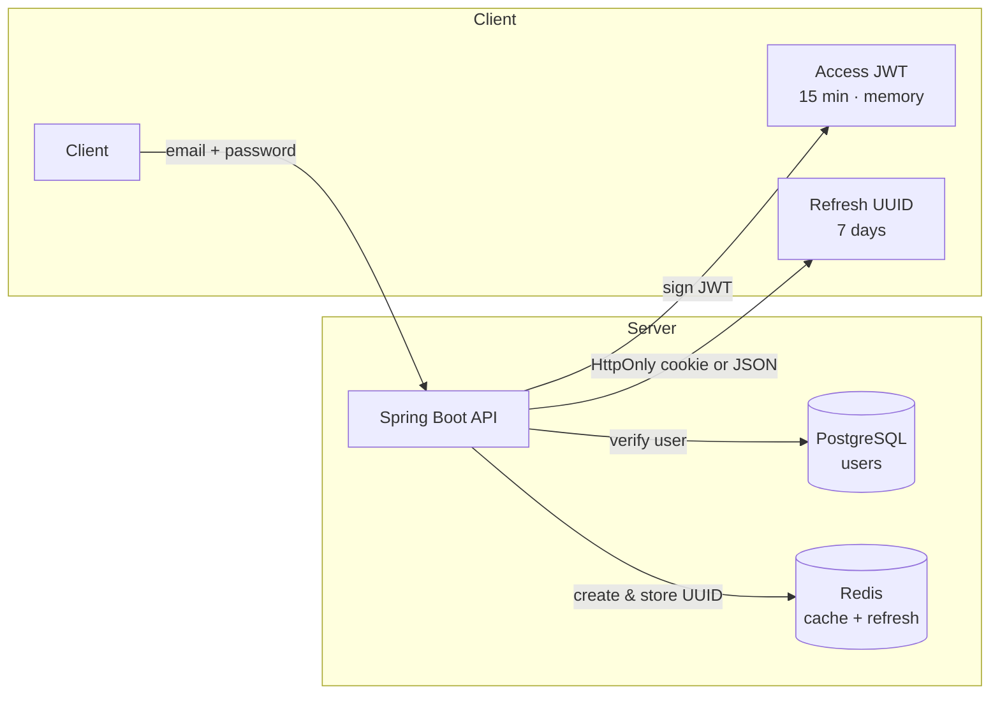
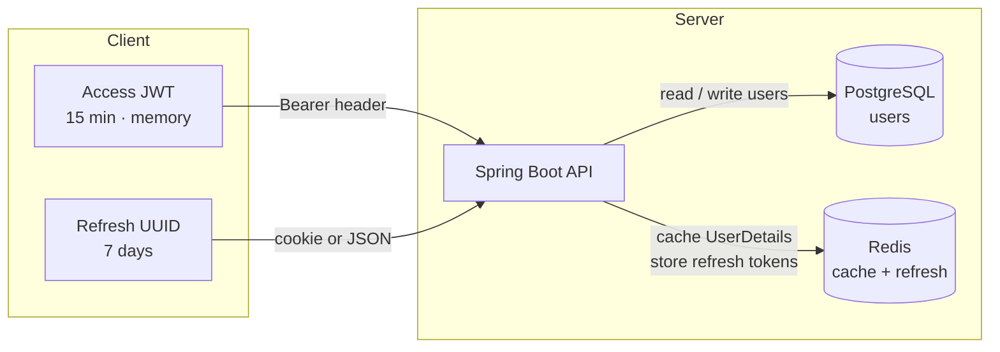
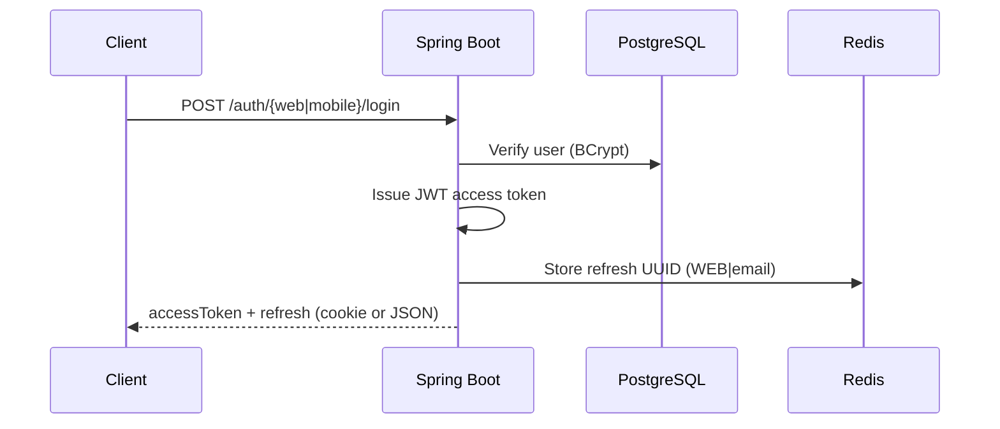
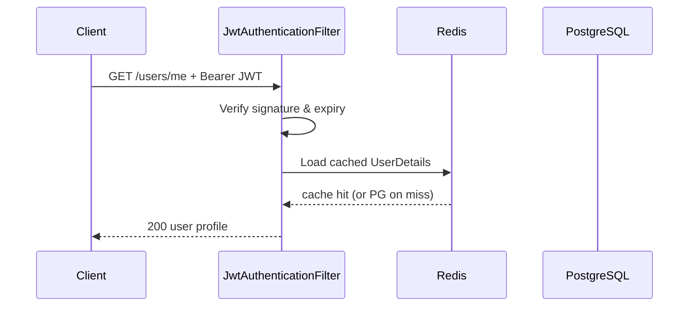
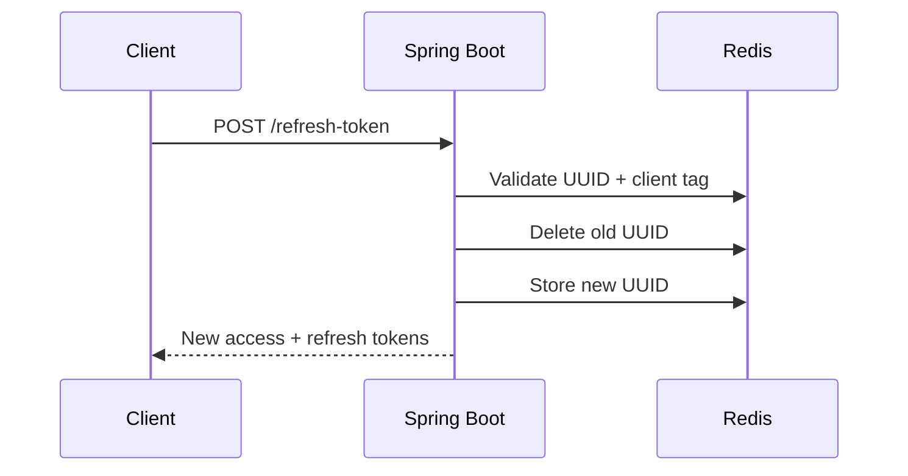

# auth-demo


**Spring Boot authentication demo** — email/password sign-in with JWT access tokens, Redis-backed refresh tokens, and separate flows for web and mobile clients.

> Originally built for **TheCompanyHealthCheck** *(private beta)*. I later decided that production-grade auth belongs in a dedicated identity provider — this repo is the extracted, self-contained reference implementation.

---

## Table of Contents

- [About](#-about)
- [Design at a glance](#-design-at-a-glance)
- [Architecture](#-architecture)
- [Web vs mobile](#-web-vs-mobile)
- [Quick start](#-quick-start)
- [API](#-api)

---

## 🚀 About

A portfolio backend project showcasing **authentication with Spring Boot**.

| | |
|---|---|
| 🔐 **Tokens** | Signed JWT **access** tokens (15 min) + opaque **refresh** tokens (7 days) |
| 🌐 **Clients** | Web (HttpOnly cookies) and mobile (JSON) via separate controllers |
| 🐘 **Postgres** | Persistent user records (email, BCrypt password, profile) |
| ⚡ **Redis** | User cache for fast lookups **and** refresh-token storage *(never in DB)* |
| 🔄 **Hybrid model** | Stateless API requests + revocable sessions via refresh tokens |

**Why hybrid?** Pure stateless JWT auth scales well but is hard to revoke. This design keeps requests stateless (signature-validated access tokens) while using short-lived access tokens to limit XSS damage and Redis-backed refresh tokens to manage sessions, rotate credentials, and force logout.

---

## 💡 Design at a glance

### Token issuance *(login / register)*



### Token usage *(API requests & refresh)*



| Layer | What | Where | TTL |
|-------|------|-------|-----|
| **Access token** | Signed JWT (`sub` = email) | Client memory / `Authorization` header | 15 min |
| **Refresh token** | Opaque UUID, tagged `WEB\|email` or `MOBILE\|email` | Redis only · cookie (web) or JSON (mobile) | 7 days |
| **User cache** | `UserDetails` snapshot | Redis | 30 min |

**Trade-off:** Access tokens cannot be revoked instantly — a stolen token works until expiry (~15 min). Refresh tokens *can* be revoked (logout, rotation), which is the session control layer.

---

## 🏗 Architecture

### Sign-in



### Protected request



### Refresh (rotation)



---

## 📱 Web vs mobile

Same auth logic, different delivery — because cookies don't work on native mobile and `localStorage` is risky on web.

```mermaid
flowchart TB
    subgraph Web["🌐 Web controller"]
        W1[Refresh in HttpOnly cookie]
        W2[Never in localStorage]
        W3[Tag: WEB|email]
    end

    subgraph Mobile["📱 Mobile controller"]
        M1[Refresh in JSON body]
        M2[Stored by the app]
        M3[Tag: MOBILE|email]
    end

    S[AuthenticationService] --> Web
    S --> Mobile
```

| | Web | Mobile |
|---|-----|--------|
| Refresh delivery | `Set-Cookie: refresh_token` (HttpOnly, SameSite=Strict) | `{ "refreshToken": "..." }` in JSON |
| Refresh/logout | Cookie + `X-Requested-With: XMLHttpRequest` | `{ "refreshToken" }` in body |
| Cross-use | ❌ WEB token rejected on mobile endpoints | ❌ MOBILE token rejected on web |

---

## ⚡ Quick start

**Prerequisites:** Java 17+, Docker

```bash
docker compose up -d      # Postgres + Redis
./mvnw spring-boot:run    # http://localhost:8080
./mvnw test               # 56 integration tests (Docker required)
```

---

## 📡 API

<details>
<summary><b>Web</b> — <code>POST /api/v1/auth/web/*</code></summary>

| Endpoint | Body | Response |
|----------|------|----------|
| `/register` | `RegisterRequest` | `{ accessToken, userId }` + refresh cookie |
| `/login` | `AuthenticationRequest` | same |
| `/refresh-token` | — (cookie) | same |
| `/logout` | — (cookie) | `200` + clears cookie |

</details>

<details>
<summary><b>Mobile</b> — <code>POST /api/v1/auth/mobile/*</code></summary>

| Endpoint | Body | Response |
|----------|------|----------|
| `/register` | `RegisterRequest` | `{ accessToken, refreshToken, userId }` |
| `/login` | `AuthenticationRequest` | same |
| `/refresh-token` | `{ refreshToken }` | same |
| `/logout` | `{ refreshToken }` | `200` |

</details>

<details>
<summary><b>Protected</b> — <code>Authorization: Bearer &lt;accessToken&gt;</code></summary>

| Endpoint | Response |
|----------|----------|
| `GET /api/v1/users/me` | `{ id, email, firstName, lastName }` |

</details>

<details>
<summary><b>Errors</b></summary>

| Scenario | HTTP | Body |
|----------|------|------|
| Missing / invalid JWT | 401 | `{ "error": "Authentication required" }` |
| Wrong password | 401 | `{ "error": "Invalid email or password" }` |
| Duplicate email | 409 | `{ "error": "Email already registered: ..." }` |
| Invalid refresh token | 401 | `{ "error": "Invalid or expired refresh token" }` |

</details>
